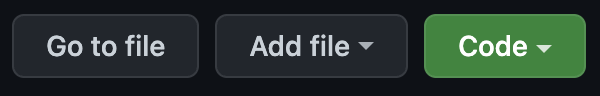

# **Tracks** - *a task manager for the unorganised*
**Author**: Tané Kaio  
****
## Concept
If you're anything like me, you need help with keeping track of your daily tasks to stay organised and ensure things are done on time. This app allows us to keep a list of our daily tasks, sorted by the time we need them done by. When we complete a task we can mark it as done, then view all of those completed tasks to remind ourselves of how productive we are! Seeing what we've accomplished is a very rewarding experience and is essential to remain motivated, so I believe we should focus on our past achievements as much as what we're working on for the future. 
****
## Instructions  
*To install Tracks*  
1. Go to https://github.com/Lanruoj/Tracks-Task-Manager
2. Locate and click the green **Code** button  

3. From the drop down menu, click **Download ZIP**

*To run as executable*  
1. Open the downloaded folder `Tracks-Task-Manager`
2. Open the `Tracks` executable file

*To run from command line*  
1. Locate application directory in terminal
> `cd Tracks-Task-Manager`
2. To run main program 
> `./Tracks todo` or `./Tracks`
3. To run help document and instructions
> `./Tracks help`

*Operating the program*  
* Choose an option from the options list and enter the corresponding key following by the enter key: for example, enter `A` to `Add a task` to the to-do list
* If you need help, enter `H` to view these instructions
* Enter `R` to refresh the program with updated times
* Enter `X` to exit the program

*Adding a task*  
1. From the home screen, enter `A`
2. Enter the task
3. If the task has a time it needs to be done by, enter `y` to assign a deadline (must be in `HH:MM` format)
4. Otherwise choose `n`
5. The task will now appear in the to-do list

*Marking a task as done*
1. From the home screen, enter `M`
2. Enter the `ID#` of the task (not the task's name), or enter `back` to cancel
3. Congratulations, you've completed a task!

*Delete a task*  
If you would like to simply delete a task:
1. From the home screen, enter `D`
2. Enter the `ID#` of the task (not the task's name), or enter `back` to cancel
3. The task will be removed from the to-do list

*View completed list*  
This is the best part! Time to see what you've accomplished today.
1. From the home screen, enter `C`
2. Press enter to return home

****
## System requirements

*Git:*
> `git version 2.32.0`

*Interpreter:*
> `Python 3.10.1`

*Dependencies:*  
> `prettytable 3.3.0`  
> `wcwidth     0.2.5`

